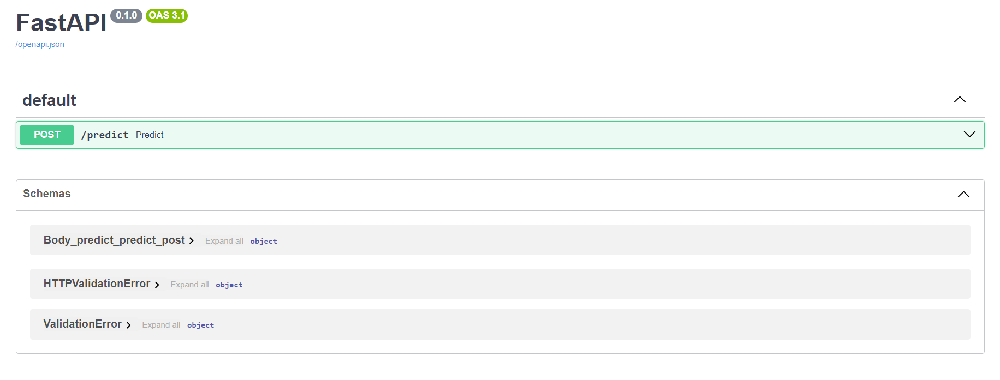

# Heartbet Sound Anomaly Detector

*Machine Learning Zoomcap Capstone 2 project*

## Table of Contents

<!--ts-->
* [Problem statement](#problem-statement)
* [Directory layout](#directory-layout)
* [Setup](#setup)
* [Running the app with Docker (Recommended)](#running-the-app-with-docker-recommended)
    * [Streamlit UI](#streamlit-ui)
    * [Backend service](#backend-service)
* [Running the app manually](#running-the-app-manually)
    * [Backend service](#backend-service-1)
    * [Streamlit UI](#streamlit-ui-1)
* [Notebooks](#notebooks)
* [Application running on Cloud](#application-running-on-cloud)
* [Checkpoints](#checkpoints)
* [References](#references)
<!--te-->

## Problem statement

This project addresses the critical challenge of early detection of heart anomalies by providing individuals with a reliable tool to assess their cardiovascular health based on heart sound analysis. Whether users are proactively monitoring their well-being or expressing concerns about potential cardiac conditions, an accurate anomaly detector is essential. To meet this need, a robust deep learning model has been developed and trained using the "Heartbeat Sound Anomaly Detection Database" [(See on references)](#references), a comprehensive collection of audio files capturing diverse heart sounds.

The database encompasses information on ten crucial audio features, including variations in heartbeats, murmurs, tones, and other distinctive sound patterns associated with cardiac health. These audio variables were meticulously analyzed to uncover hidden patterns and gain valuable insights into factors influencing heart anomalies. Subsequently, a cutting-edge deep learning model was rigorously trained, validated, and deployed in real-time, enabling efficient and accurate detection of heart anomalies through the analysis of heartbeat sounds.

By leveraging this innovative solution, individuals can proactively monitor their cardiovascular health, receive timely alerts for potential anomalies detected in heartbeat sounds, and take preventive measures to ensure their well-being. The implementation of advanced technology in this domain empowers users to make informed decisions about their heart health, contributing to early intervention and improved cardiovascular outcomes.

## Directory layout

```
.
├── backend_app             # Backend files
├── config_management       # Config files
├── frontend_app            # Directory with files to create Streamlit UI application
├── images                  # Assets
├── model_pipeline          # Files to preprocess and train the model
└── notebooks               # Notebooks used to explore data and select the best model

6 directories
```

## Setup

1. Rename `.env.example` to `.env` and set your Kaggle credentials in this file.
2. Sign into [Kaggle account](https://www.kaggle.com).
3. Go to https://www.kaggle.com/settings
4. Click on `Create new Token` to download the `kaggle.json` file
5. Copy `username` and `key` values and past them into `.env` variables respectively.
6. Make installation:

<!--ts-->
* For UNIX-based systems and Windows (WSL), you do not need to install make.
* For Windows without WSL:
    * Install chocolatey from [here](https://chocolatey.org/install)
    * Then, `choco install make`.
<!--te-->

## Training model

* Create a conda environment: `conda create -n <name-of-env> python=3.10`
* Start environment: `conda activate <name-of-env>` or `source activate <name-of-env>`

* Install pytorch dependencies:  

__With GPU__:  
`pip install torch torchvision torchaudio --index-url https://download.pytorch.org/whl/cu121`  

__With CPU__:  
`pip install torch torchvision torchaudio --index-url https://download.pytorch.org/whl/cpu`  

* Install rest of dependencies:  
`pip install kaggle pandas numpy seaborn pyyaml numpy matplotlib ipykernel librosa`
* Run `make train`
* The models will be saved to `pth_models` directory

This same environment can be used to run the notebooks in `notebooks/` directory

## Running the app with Docker (Recommended)

Run `docker-compose up --build` to start the services at first time or `docker-compose up` to start services after the initial build

* `http://localhost:8501` (Streamlit UI)
* `http://localhost:8000` (Backend service)

The output should look like this:


* ### Streamlit UI

User interface designed using Streamlit to interact with backend endpoints:


* ### Backend service

Swagger documentation for FastAPI backend:



* Stop the services with `docker-compose down`

## Notebooks

Run notebooks in `notebooks/` directory to conduct Exploratory Data Analysis.

## Application running on Cloud


The application has been deployed to cloud using AWS ElasticBeanstalk, both frontend and backend were separately deployed using `eb` command:

## Checkpoints

- [x] Problem description
- [x] EDA
- [x] Model training
- [x] Exporting notebook to script
- [x] Reproducibility
- [x] Model deployment
- [x] Dependency and enviroment management
- [x] Containerization
- [x] Cloud deployment (master)
- [ ] Linter
- [ ] CI/CD workflow
- [ ] Pipeline orchestration
- [ ] Unit tests

## References

* [Dataset] https://www.kaggle.com/datasets/kinguistics/heartbeat-sounds
* https://pytorch.org/audio
* https://medium.com/@muhammad2000ammar/mastering-transfer-learning-with-pytorch-d1521f3a6a6e